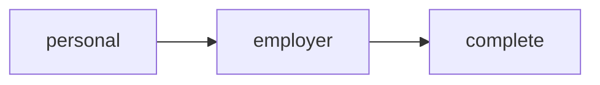
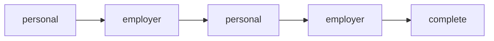
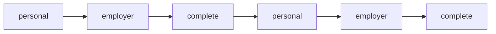

# targeted-e2e-execution 運用ガイド

このSKILLは、スプレッドシートの項目定義書から再利用可能な共通E2Eテスト仕様書を作り、その仕様書から実行計画を生成して、ユーザーの明示承認後にブラウザで実行します。Playwrightのテストコードは作成しません。

## 全体像

```text
スプレッドシート項目定義書
          ↓
共通形式の test-spec.yml へ正規化
          ↓
登録済みflow・device・sessionを付加して plan.yml へ展開
          ↓
人間向け plan.md を生成
          ↓
ユーザーが対象runを承認
          ↓
plan.yml に展開済みの経路で対象画面へ移動
          ↓
ケース実行・証跡取得・report.md生成
```

承認前に対象Webアプリケーションをブラウザで調査しません。テストケースは項目定義書、`spreadsheet-mappings.yml`、`test-patterns.yml` だけから確定します。情報が不足する場合は推測せず、共通仕様書の未解決事項として止めます。

## ファイルの役割

| ファイル | 役割 |
|---|---|
| `SKILL.md` | AIが守る実行手順と承認ルール |
| `defaults.yml` | 画面path、フィールドlocator、有効なデフォルト値 |
| `flows.yml` | 対象画面へ到達する順序付き画面遷移 |
| `spreadsheet-mappings.yml` | 項目定義書の列、必須値、形式の変換規則 |
| `test-patterns.yml` | 項目定義書からケースを導出するpatternと期待結果 |
| `references/spreadsheet-field-definition.md` | 6列の読み方とケース導出規則 |
| `references/test-spec-format.md` | 共通 `test-spec.yml` のschema |
| `references/flow-format.md` | `flows.yml` のschemaと静的検証規則 |
| `references/plan-format.md` | 機械実行用 `plan.yml` の共通形式 |
| `references/test-catalog.md` | pattern、条件、step、期待結果の用語定義 |
| `references/evidence-format.md` | run、計画、レポート、画像の保存形式 |
| `templates/plan-template.md` | 人間が承認する `plan.md` の表示形式 |
| `templates/report-template.md` | 実行結果 `report.md` の表示形式 |

## 項目定義書から共通仕様書を作る

1 sheetを1画面として扱い、変換時に対応するpage IDを指定します。列順は自由ですが、次の見出しを完全一致で使用します。

| 項目名 | DOMのid | 形式 | 必須有無 | 初期値 | 補足文言 |
|---|---|---|---|---|---|
| 電話番号 | employer-phone | 半角数字 | 必須 |  | 半角数字で入力してください |

- `DOMのid` は先頭`#`なしの生IDを記載します。
- `形式` は `spreadsheet-mappings.yml` の語彙へ一致させます。未知の値は推測しません。
- `初期値` はcontrol別規則で比較します。text/textareaはvalue、select/radioの非空値は表示label、checkboxはchecked状態です。
- `初期値` の空欄は、text/textareaでは空文字、select/radioでは未選択、checkboxでは未チェックを意味します。
- `補足文言` の空欄は補足なしを意味します。
- 最大長、選択肢、送信結果など、6列にない仕様からケースを追加しません。
- 未知の形式などはpartial itemと構造化された `unresolved` に残し、その行のケースと実行計画は作りません。
- passwordなど秘密値形式の初期値はrawにも保存せず、セル参照と `***` だけを残します。

生成物は、セル参照、raw値、正規化済み項目、確定ケースを持つ `test-spec.yml` だけです。仕様書だけを作る場合は、spec ID、revision、項目数、ケース数、非適用件数とファイルへのリンクをチャットで提示します。`unresolved` がある場合は対象sheet・セル、理由、必要な修正もチャットで示し、実行計画は作りません。

共通仕様書にはflow、device、session、run IDを含めません。同じ画面の仕様書を3つのflowやPC/SPの複数runで再利用できます。実行計画は参照するspec ID、revision、SHA-256を固定し、計画作成時にケースを再推論しません。

## 画面遷移の3パターン

現行デモの `flows.yml` には、実装済みUIから確認できる3経路を登録しています。

### standard-completion



通常の入力完了経路です。

### return-and-correct



勤務先情報画面の「戻る」で基本情報へ戻り、再入力して完了します。

### repeat-after-completion



一度完了した後、「最初からやり直す」で再度完了します。

後者2つは業務上の条件分岐ではなく、デモの戻る・再開操作を表す派生経路です。別プロジェクトに適用するときは、`flows.yml` の各flowを実際の3業務パターンへ置き換えます。

## flows.ymlの追加・変更

各flowは、他のflowを参照せず、開始画面から終了画面までのstepを順番どおりに記載します。重複する遷移も省略しません。これにより、計画承認時に選択した経路を1か所で確認できます。

項目定義書には画面遷移情報がないため、実行計画では `flows.yml` に登録されたflowだけを使用します。

```yaml
- id: application-standard
  description: 標準申込経路
  start_page: screen-a
  end_page: screen-c
  session_policy: auto
  steps:
    - id: a-to-b
      from: screen-a
      prepare:
        defaults: [field-a]
      action:
        type: submit
        locator: "#next"
      to: screen-b
    - id: b-to-c
      from: screen-b
      prepare:
        defaults: [field-b]
      action:
        type: submit
        locator: "#complete"
      to: screen-c
```

追加時は次を確認します。

- `start_page`、`end_page`、各stepの `from` と `to` が `defaults.yml` に存在する
- 直前stepの `to` と次stepの `from` が一致する
- `prepare.defaults` が遷移元画面のfieldsに存在する
- locatorが対象画面で遷移操作を一意に特定する
- submitやclick後の遷移先が `to` と一致する

対象画面がflowの途中にある場合は、`target_arrival` に到達直前のstep IDを記録し、`resolved_flow` をそのstepまでで止めます。同じ画面へ複数回到達するflowでも、どの時点でケースを実行するかを一意にできます。

## セッション方針

`session_policy` は `auto` です。同一deviceで基準状態へ戻せる限り、同じセッションを再利用します。ただし、各ケース前に計画済みのreset profileを実行し、前ケースの状態は引き継ぎません。

radio/checkboxのdefaultがboolean `true` の場合は、対象要素を選択またはcheckします。文字列の `"true"` として入力しません。

次の場合は新しいセッションを作り、必要なflowを最初から実行します。

- PCとSPなどdeviceが変わる
- submit後に対象画面へ戻れない
- 認証やワンタイム状態の分離が必要
- ケース失敗後の状態が不明
- 計画で新規セッションが指定されている

実際のセッション境界と再作成理由は `report.md` に記録します。

## 承認と実行

承認対象は、同じrunに保存された `plan.yml` と `plan.md` です。`test-spec.yml` は再利用する共通仕様の正本であり、別の実行承認ゲートは設けません。

- `plan.yml`: 機械実行の正本
- `plan.md`: 画面遷移図、操作フロー、ケース、状態変更を確認する人間向け表示

計画を提示したメッセージとは別のユーザーメッセージで、対象runが明示的に承認された場合だけブラウザを開きます。承認後に計画内容を変更しません。共通仕様書または計画に未解決事項が1件でもあれば承認を求めません。参照仕様書のrevisionまたはSHA-256が変わった場合は新しいrunで計画を作り直します。

`plan.yml` は共通仕様書の項目とケースを内容変更せずdevice別に展開します。項目定義書の初期値は初期画面の期待状態、`defaults.yml` のdefaultは画面遷移や非対象項目を有効にする値です。両者は異なっていてもよく、初期値ケースは `apply_target_defaults: false` の専用reset profileで実行します。対象画面CへA/B経由で到達する場合もA/Bの遷移用defaultだけを使い、Cの対象項目defaultは適用しません。

実行時に画面へ到達できなければ、後続画面のテストを `NG` にせず `blocked` とします。実画面が計画と異なり、UI種別、制約、遷移、ケース、期待結果を変える必要がある場合は `configuration drift` として停止し、新しいrunで再計画します。

## 成果物

```text
test-specs/<spec-id>/
  test-spec.yml

test-results/<run-id>/
  plan.yml
  plan.md
  report.md
  <case-id>--<checkpoint>.png
```

パスワード、token、そのほかの秘密値は計画と結果でマスクします。秘密値が画像へ平文で写る場合は撮影しません。
